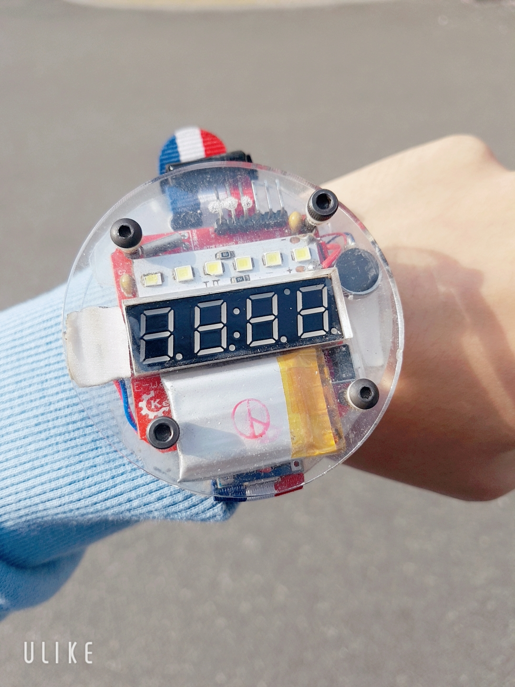

# Bigtime watch version Function

## Introduction

2019년 어느 봄에서 여름으로 넘어가는 입하(立夏), 부족하고 답답했던 본인에게 컴퓨터의 세계에 걸음마를 걷게 해준 꼬마 스승에게 이 저장소를 빌어 감사를 드립니다.

It is moving from one spring to summer in 2019. Thank you for this repository to the little teacher who let me walk in the world of computers. Here, I express the necessity of coding and what I can do with coding in my style.

## Origin repositories (Forked)

https://github.com/sparkfun/BigTime

>Sparkfun : [TV B Gone](https://github.com/sparkfun/BigTime) 기능을 Release 하였습니다.

## Model

  

7- segment 와 Main Button 1개로 구성되어 간단한 시간 확인이 가능합니다.  

  

기존 기능에서 다양한 모듈을 활성화 및 구현할 수 있도록 버튼 클릭을 얼마나 지속하고 있는지를 확인하는 **버튼 입력 시간차** 결과에 따라 기능을 수행합니다.    

## how to different ?

다양한 기능을 구현할 수 있게 메뉴 전환 기능을 추가하였습니다.  
It is main features are `vibration notifications`, `laser`, `flashlights`, and `bulls and caws`.

### Movie

-> [여기](https://youtube.com/shorts/xjuo3ZrRKAQ?feature=share)를 참고하세요.