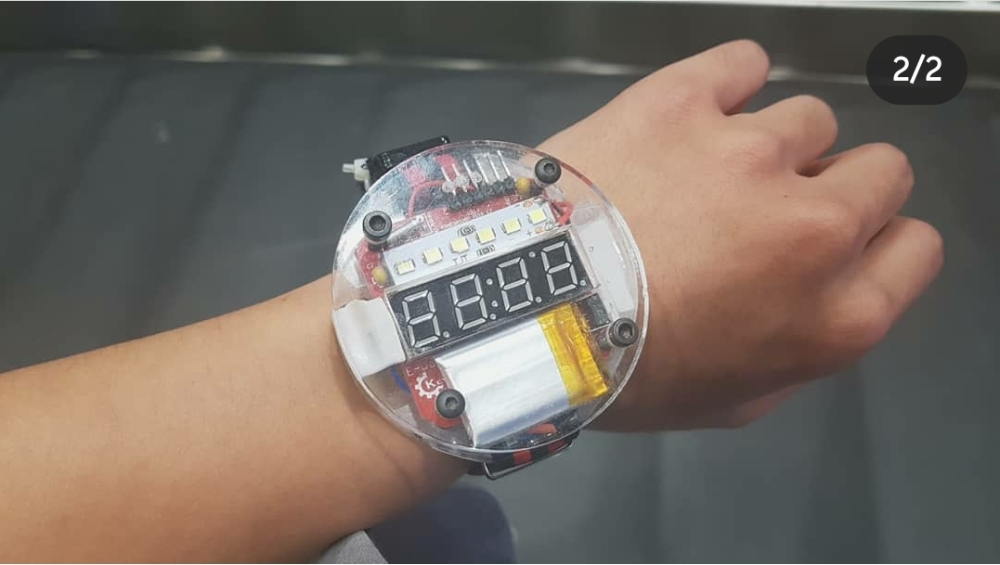

## intro

2019년 어느 봄에서 여름으로 넘어가는 입하(立夏), 부족하고 답답했던 본인에게 컴퓨터의 세계에 걸음마를 걷게 해준 꼬마 스승에게 이 저장소를 빌어 감사를 드립니다.

It is moving from one spring to summer in 2019. Thank you for this repository to the little teacher who let me walk in the world of computers. Here, I express the necessity of coding and what I can do with coding in my style.

## Thank you

https://github.com/sparkfun/BigTime

## model

## what is that ?

add remote tv b gone (release) and fixed bug 

## how to different ?

It iss main features are `vibration notifications`, `laser`, `flashlights`, and `bulls and caws`.